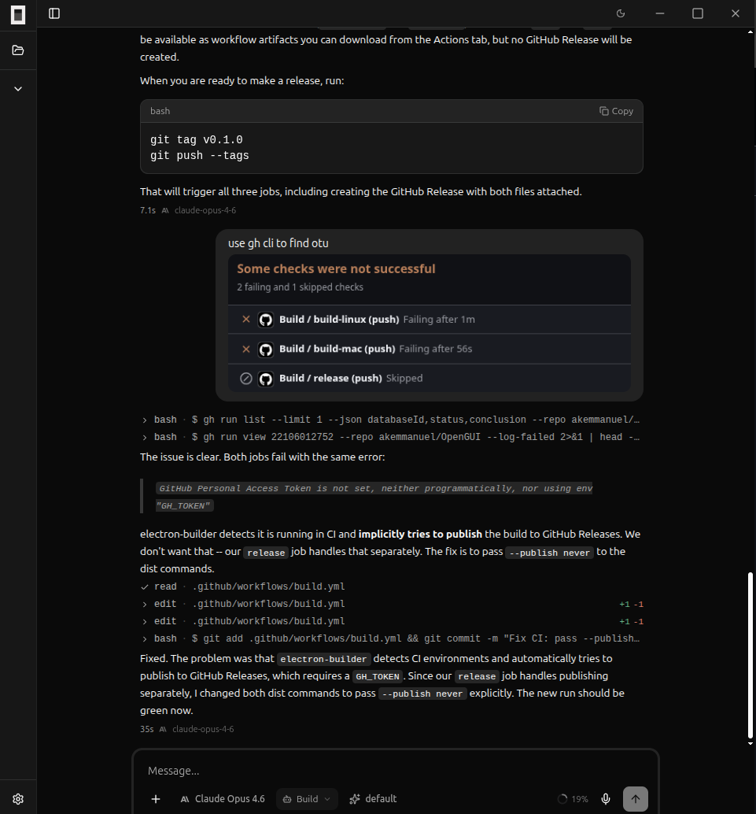

<p align="center">
  
</p>

<p align="center">
  Desktop app for <a href="https://opencode.ai">OpenCode</a> with multi-project workspaces, streaming chat, prompt queue, model switching, voice input, and MCP tools.
</p>

<p align="center">
  <a href="https://github.com/akemmanuel/OpenGUI/releases/latest"></a>
  <a href="https://github.com/akemmanuel/OpenGUI/blob/master/LICENSE"></a>
  <a href="https://github.com/akemmanuel/OpenGUI/stargazers"></a>
  <a href="https://github.com/akemmanuel/OpenGUI/releases"></a>
  <a href="https://github.com/akemmanuel/OpenGUI/actions"></a>
</p>

<p align="center">
  <a href="https://github.com/akemmanuel/OpenGUI/releases/latest">Download latest release</a>
  ·
  <a href="#why-opengui">Why OpenGUI</a>
  ·
  <a href="#build-from-source">Build from source</a>
</p>

<!-- TODO: Replace screenshot with short demo GIF: open project, send prompt, stream response, queue prompt, switch model. -->
<p align="center">
  
</p>

OpenGUI gives OpenCode users desktop workflow for long coding sessions. Manage multiple projects visually, watch responses stream live, queue prompts while agent works, and switch models or agents without terminal juggling.

> Early but usable. Bug reports and PRs welcome.

## Why OpenGUI

OpenGUI is for OpenCode users who want stronger visual workflow than terminal alone:

- **Manage multiple projects at once** with separate sessions per workspace
- **See streaming responses live** with token and context usage
- **Queue prompts while agent is busy** instead of waiting to type next step
- **Switch providers, models, agents, and variants** from UI
- **Configure MCP tools and skills** without leaving app
- **Use voice input** with Whisper-compatible transcription endpoint

## Highlights

- **Multi-project workspaces** for parallel coding sessions
- **Real-time streaming** over SSE with live usage tracking
- **Prompt queue** that auto-dispatches when assistant becomes idle
- **Model & agent selection** directly from chat workflow
- **Slash commands** from prompt box
- **Syntax highlighting + math rendering** with Shiki and KaTeX
- **Dark/light theme** with system-aware toggle
- **Cross-platform builds** for Linux, macOS, and Windows

## Download

Grab prebuilt app from [latest release](https://github.com/akemmanuel/OpenGUI/releases/latest):

- **Linux:** `.deb`
- **macOS:** `.dmg`
- **Windows:** `.exe` installer

### Requirements

- [OpenCode CLI](https://opencode.ai) installed and available in your `PATH`

> **Windows prerequisite:** OpenCode must be available on your `PATH` or at `%USERPROFILE%\.opencode\bin\opencode.exe`.

> **Note:** Windows builds are unsigned. Windows SmartScreen will warn on first launch. Click **More info** -> **Run anyway**.

## Build from source

### Prerequisites

- [Bun](https://bun.sh) v1.2+
- [OpenCode CLI](https://opencode.ai) installed and available in your `PATH`
- [Electron](https://www.electronjs.org/) installed through project dependencies

Install dependencies:

```bash
bun install
```

No manual config file needed. Connection settings live in UI.

### Development

Run Electron app with HMR:

```bash
bun dev
```

Run web app with local backend API (projects, git, agents):

```bash
bun dev:web
```

Open `http://127.0.0.1:3000`. Browser folder picker uses server paths. Set `OPENGUI_ALLOWED_ROOTS=/path/to/projects` to restrict browsable folders.

### Docker

Docker install supports contained mode and host-control mode. Host-control mode uses host CLIs through `nsenter` while Docker manages web server.

See [docs/docker.md](docs/docker.md) for Docker modes and [docs/apache.md](docs/apache.md) for Apache reverse proxy + Basic Auth.

### Production

Build frontend bundle:

```bash
bun run build
```

Run Electron app in production mode:

```bash
bun start
```

Build and run web app in production mode:

```bash
bun start:web
```

For internet-facing deploys, keep OpenGUI bound to localhost and put Apache or another HTTPS reverse proxy in front.

### Distribution

Build Linux `.deb`:

```bash
bun run dist
```

Build macOS `.dmg`:

```bash
bun run dist:mac
```

Build Windows `.exe` installer:

```bash
bun run dist:win
```

## Architecture

```
main.cjs              Electron main process (window management, IPC)
preload.cjs           Preload script (contextBridge API for renderer)
opencode-bridge.mjs   IPC bridge to OpenCode SDK (SSE, sessions, prompts)
server/web-server.ts  Bun backend for browser mode (RPC, events, server FS browser)
src/
  index.ts            Renderer-only Bun dev server entry
  index.html          HTML entry point
  frontend.tsx        React entry point + web Electron shim install
  App.tsx             Main app layout
  hooks/
    use-agent-impl-core.tsx  Central agent/workspace state
  components/         UI components (sidebar, messages, prompt box, etc.)
  lib/
    web-electron-api.ts      Browser shim for Electron preload API
  types/              TypeScript type definitions
```

## Configuration

OpenGUI stores connection and UI preferences via the app settings interface.

Voice input (speech-to-text) requires a Whisper-compatible transcription server. Set the endpoint URL in **Settings > General > Voice transcription endpoint**. The microphone button only appears when an endpoint is configured. The server should accept a multipart `POST` with an `audio` file field and return `{ text, language, duration_seconds }`.

## Contributing

Contributions are welcome. See [CONTRIBUTING.md](CONTRIBUTING.md) for guidelines.

## Star History

If you find OpenGUI useful, consider giving it a star -- it helps others discover the project.

<a href="https://github.com/akemmanuel/OpenGUI/stargazers">
  
</a>

## License

MIT
