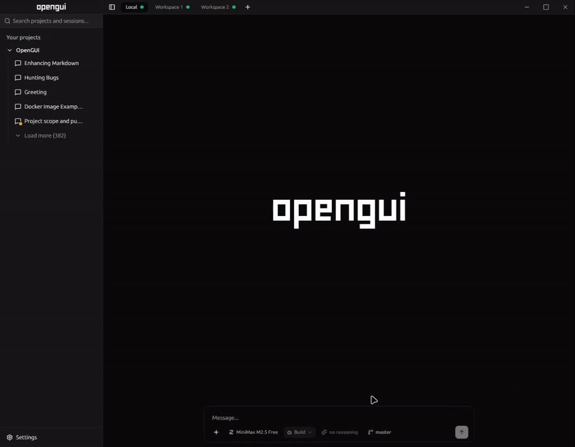

<p align="center">
  
</p>

<p align="center">
  Desktop + web command center for coding-agent Harnesses. Run <a href="https://opencode.ai">OpenCode</a>, Claude Code, Codex, and Pi across multiple projects with streaming chat, prompt queue, model switching, voice input, and MCP tools.
</p>

<p align="center">
  <a href="https://github.com/akemmanuel/OpenGUI/releases/latest"></a>
  <a href="https://github.com/akemmanuel/OpenGUI/blob/master/LICENSE"></a>
  <a href="https://github.com/akemmanuel/OpenGUI/stargazers"></a>
  <a href="https://github.com/akemmanuel/OpenGUI/releases"></a>
  <a href="https://github.com/akemmanuel/OpenGUI/actions"></a>
</p>

<p align="center">
  <a href="https://github.com/akemmanuel/OpenGUI/releases/latest">Download latest release</a>
  ·
  <a href="#why-opengui">Why OpenGUI</a>
  ·
  <a href="#supported-harnesses">Supported Harnesses</a>
  ·
  <a href="#build-from-source">Build from source</a>
</p>

<!-- TODO: Replace screenshot with short demo GIF: open project, switch backend, send prompt, stream response, queue prompt. -->
<p align="center">
  
</p>

OpenGUI gives coding-agent users desktop and browser workflow for long sessions. Manage multiple projects visually, run different Harnesses from one UI, watch responses stream live, queue prompts while agent works, and switch models or agents without terminal juggling.

> Early but usable. Bug reports and PRs welcome.

## Why OpenGUI

OpenGUI is for people who like coding agents but want stronger workflow than terminal tabs alone:

- **Run multiple Harnesses in one app** instead of juggling separate tools
- **Manage multiple projects at once** with separate sessions per workspace
- **See streaming responses live** with token and context usage
- **Queue prompts while agent is busy** instead of waiting to type next step
- **Switch providers, models, agents, and variants** from UI
- **Configure MCP tools and skills** without leaving app
- **Use voice input** with Whisper-compatible transcription endpoint

## Highlights

- **Multi-agent workspace** for OpenCode, Claude Code, Codex, and Pi
- **Multi-project workspaces** for parallel coding sessions
- **Real-time streaming** over SSE with live usage tracking
- **Prompt queue** that auto-dispatches when assistant becomes idle
- **Model, backend, and agent selection** directly from chat workflow
- **Slash commands** from prompt box
- **Syntax highlighting** with Shiki
- **Dark/light theme** with system-aware toggle
- **Desktop, web, and Docker deployment options**
- **Cross-platform builds** for Linux, macOS, and Windows

## Supported Harnesses

OpenGUI currently supports these coding-agent Harnesses:

- **OpenCode**
- **Claude Code**
- **Codex**
- **Pi**
- **Grok Build**

Use one backend or switch between them per workflow.

## Download

Grab prebuilt app from [latest release](https://github.com/akemmanuel/OpenGUI/releases/latest):

- **Linux:** `.deb`
- **macOS:** `.dmg`
- **Windows:** `.exe` installer

### Requirements

Backend requirements depend on what you use:

- **OpenCode Harness:** [OpenCode CLI](https://opencode.ai) installed and available in your `PATH`
- **Grok Build Harness:** [Grok Build CLI](https://x.ai/cli) installed (`grok` on `PATH`) and authenticated (`grok login` or `XAI_API_KEY`)
- **Other Harnesses:** local CLI/auth/config for that Harness available on your machine

> **Windows prerequisite for OpenCode:** OpenCode must be available on your `PATH` or at `%USERPROFILE%\.opencode\bin\opencode.exe`.

> **Note:** Windows builds are unsigned. Windows SmartScreen will warn on first launch. Click **More info** -> **Run anyway**.

## Build from source

### Prerequisites

- [Node.js](https://nodejs.org/) 24+
- [pnpm](https://pnpm.io/) 11+ package manager
- At least one supported Harness configured locally (for example OpenCode CLI in your `PATH` for OpenCode)

OpenGUI uses Node.js as the runtime for the Electron/web backend and pnpm for dependency management. **Vite+** ([vite-plus](https://github.com/mariozechner/vite-plus)) is a dev dependency: after `pnpm install`, run it as **`pnpm vp <command>`** (for example `pnpm vp build`). You do not install Electron or Vite+ globally—Electron and other app dependencies come from `pnpm install`.

Install dependencies:

```bash
pnpm install
```

### Tooling (Vite+)

Lint, format, typecheck, test, build, and named tasks use Vite+ (`vp`). Prefer **`pnpm vp …`** or **`pnpm run <script>`** when a script exists in `package.json`. A global `vp` on your `PATH` is optional, not required.

No manual config file needed. Connection settings live in UI. Pick a Harness, connect a workspace, start prompting.

### Development

Desktop: **`pnpm run dev`**. Web (browser + API): **`pnpm run dev:web`** — same task with **`:web`** appended.

| Goal                               | Command            |
| ---------------------------------- | ------------------ |
| Desktop app (Electron, hot reload) | `pnpm run dev`     |
| Web UI only (browser + API)        | `pnpm run dev:web` |

For web dev, open the URL Vite prints in the terminal (default port is often 5173). Browser folder picker uses server paths. Set `OPENGUI_ALLOWED_ROOTS=/path/to/projects` to restrict browsable folders.

### Docker

Official image: `ghcr.io/akemmanuel/opengui:latest`.

Docker install supports contained mode and host-control mode. Host-control mode uses host CLIs through `nsenter` while Docker manages web server.

See [docs/docker.md](docs/docker.md) for GHCR install, Docker modes, and [docs/apache.md](docs/apache.md) for Apache reverse proxy + Basic Auth.

### Production

Build frontend bundle:

```bash
pnpm run build
```

(`pnpm vp build` is equivalent.)

Desktop production: **`pnpm run start`**. Web production: **`pnpm run start:web`** (append **`:web`** to the start task). Build the bundle first with `pnpm run build`.

```bash
pnpm run start      # Electron
pnpm run start:web  # browser + backend API
```

For internet-facing deploys, keep OpenGUI bound to localhost and put Apache or another HTTPS reverse proxy in front.

### Distribution

Build Linux `.deb`:

```bash
pnpm run dist:linux
```

Build macOS `.dmg`:

```bash
pnpm run dist:mac
```

Build Windows `.exe` installer:

```bash
pnpm run dist:win
```

## Architecture

Four layers ([`CONTEXT.md`](CONTEXT.md), [ADR 0005](docs/adr/0005-opengui-runtime-backend-split-and-sdk.md)):

- **OpenGUI Runtime** — in-process Harness Adapters and execution (`@opengui/runtime`)
- **OpenGUI Backend** — embeds Runtime; HTTP/SSE, queues, shared session control (`@opengui/backend`; `server/web-server.ts` is the listen entry)
- **OpenGUI Frontend** — React UI; Workspaces, Projects, pending/queued prompt UI (`src/`)
- **Shell** — Desktop, Web, or Mobile bootstrap (`main.ts`, browser, Capacitor)

```
main.ts              Desktop Shell (window, IPC, backend sidecar)
preload.js           Desktop Shell preload API
packages/runtime/src/adapters/*  Harness Adapters (hosted inside Backend via Runtime)
packages/backend/src/     OpenGUI Backend host (SSE, RPC, FS, product API)
server/web-server.ts      Thin HTTP listen entry (calls createBackendHost)
src/
  index.html          HTML entry point
  frontend.tsx        React entry point + web Electron shim install
  App.tsx             Main app layout/orchestrator
  agents/             Harness descriptors, event normalizers, and protocol mappers
  features/           Cross-component frontend orchestration hooks
  hooks/              Agent state, model state, and UI hooks
  components/         UI components (sidebar, messages, prompt box, dialogs, etc.)
  components/ui/      Reusable UI primitives such as DialogShell
  lib/                Utility modules and browser Electron shim
  types/              TypeScript type definitions
```

See [docs/architecture.md](docs/architecture.md) for contributor architecture notes and the Harness addition guide.

## Configuration

OpenGUI stores connection and UI preferences via the app settings interface.

Voice input (speech-to-text) requires a Whisper-compatible transcription server. Set the endpoint URL in **Settings > General > Voice transcription endpoint**. The microphone button only appears when an endpoint is configured. The server should accept a multipart `POST` with an `audio` file field and return `{ text, language, duration_seconds }`.

## SDK (`@opengui/runtime`)

Embed the same in-process harness runtime the app uses—list sessions, stream events, and send prompts on a filesystem **directory** without HTTP or React. Pi quickstart and API contracts: [`packages/runtime/README.md`](packages/runtime/README.md).

## Contributing

Contributions are welcome. See [CONTRIBUTING.md](CONTRIBUTING.md) for guidelines.

## Star History

If you find OpenGUI useful, consider giving it a star -- it helps others discover the project.

<a href="https://github.com/akemmanuel/OpenGUI/stargazers">
  
</a>

## License

MIT
